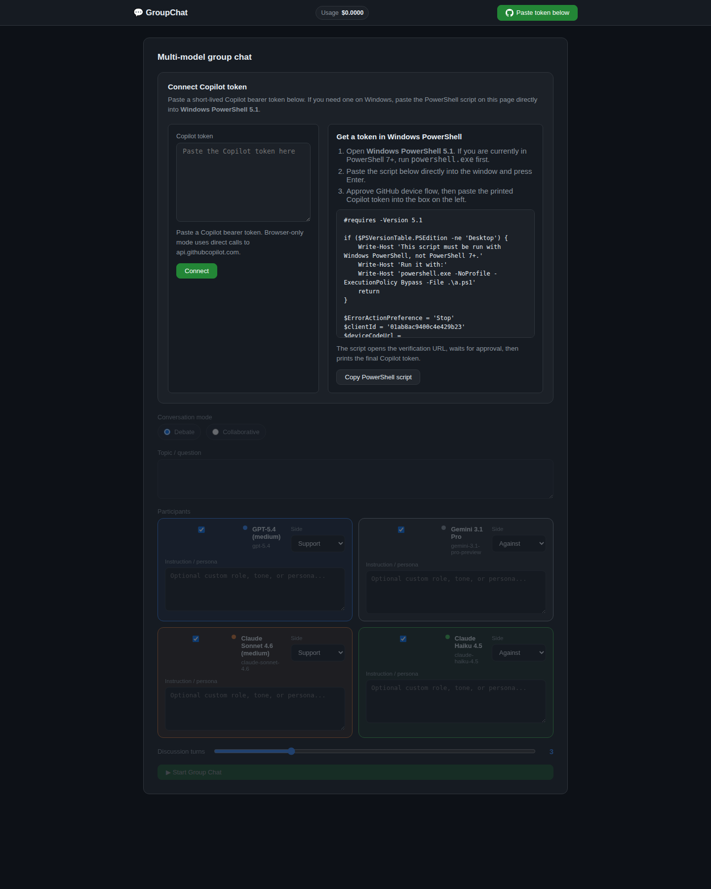
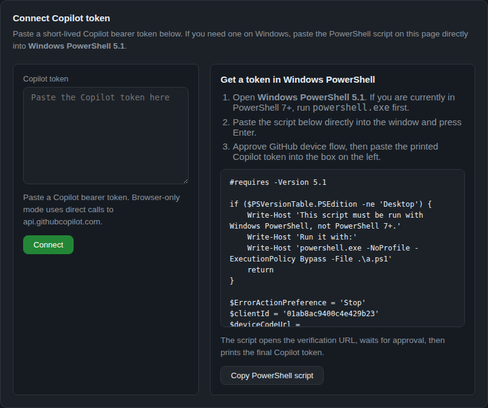

# GroupChat

Browser-only multi-model discussion powered by **GitHub Copilot**. Paste a Copilot token, pick the models you want, choose a discussion mode, give each model its own role/persona, and export the full conversation as Markdown.

Deploy the built `dist/` folder to any static host you control, then open your deployed site in the browser.

> **GitHub Copilot subscription required.** Users need an active GitHub Copilot subscription to get a token and run model calls from this app.

## Screenshots

### Landing page



### Token onboarding



## What it does

- Runs entirely from static assets in the browser
- Supports **Debate**, **Collaborative**, and **Free discussion** modes
- Lets you enable models with explicit checkboxes
- Lets you assign per-model side selection for debate mode
- Lets you add separate instructions/personas for each model
- Saves customizations in browser storage
- Retries transient Copilot API glitches with backoff
- Exports the active conversation to a downloadable `.md` file

## Requirements

- GitHub account
- GitHub Copilot subscription ([Individual, Business, or Enterprise](https://github.com/features/copilot))

## Quick start

```bash
npm install
npm run dev
```

Then open the local Vite URL, paste a Copilot token, and start a discussion.

### Production build

```bash
npm run build
npm run preview
```

After `npm run build`, the deployable output is just the static `dist/` folder.

## Token flow

- The app does **not** ship with a backend
- Users paste a short-lived Copilot bearer token into the page
- The onboarding UI includes a Windows PowerShell script that can fetch a token for users with GitHub Copilot
- The token and chat customizations are stored in browser storage on that machine

## Project structure

```text
groupchatpage/
├── index.html
├── docs/screenshots/
├── src/
│   ├── main.ts                 UI wiring and chat lifecycle
│   ├── config.ts               Model list and app constants
│   ├── group-chat.ts           Round orchestration
│   ├── group-chat-helpers.ts   Prompt construction by mode
│   ├── copilot.ts              Copilot request + retry logic
│   ├── chat-preferences.ts     Browser-side customization persistence
│   ├── conversation-export.ts  Markdown export
│   └── style.css               Layout and styling
├── tests/unit/
└── .github/copilot-instructions.md
```

## Forking and extending

- Add or swap models in `src/config.ts`
- Add new modes or prompt behavior in `src/group-chat-helpers.ts`
- Add new persisted controls in `src/chat-preferences.ts`
- Adjust export formatting in `src/conversation-export.ts`
- Read `.github/copilot-instructions.md` for repo-specific AI/developer guidance

## Testing

```bash
npm test
npm run test:e2e
```

The repo also enforces a hard rule that every tracked `.ts` file must stay at **500 lines or fewer**.
